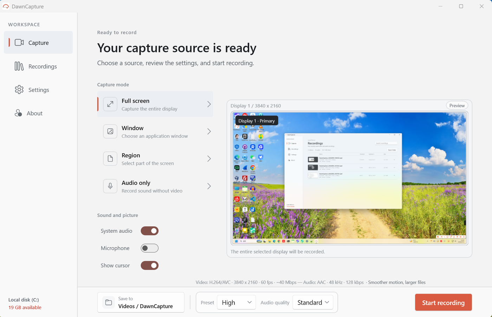

<h1 align="center">
  <br>
  DawnCapture
</h1>

<p align="center">
  A lightweight, focused screen recorder for Windows<br>
  Window · Full screen · Region · Audio only — your recordings stay on your machine
</p>

<p align="center">
  <a href="LICENSE"></a>
  
  
  
</p>

<p align="center">
  <b>English</b> · <a href="README.zh-CN.md">简体中文</a>
</p>

<p align="center">
  <a href=".github/assets/main-window.png"></a>
</p>

## Features

- **Four capture modes** — full screen (pick a display), window, region, or audio only (M4A)
- **Two audio sources** — system audio and microphone, switched independently
- **Hardware-accelerated encoding** — H.264 by default, HEVC optional, with automatic fallback when the device cannot encode it
- **Countdown and cursor** — 1–60 second countdown (Esc cancels), optional cursor capture
- **Floating control bar** — always on top, showing the recording state and elapsed time; pause, resume, stop, drag it anywhere
- **Recording library** — thumbnails, duration, size and media information; rename, delete to the Recycle Bin, or reveal in File Explorer
- **Global hotkeys and tray** — hotkeys are customizable and unregistered while recording so they cannot clash; closing the window can minimize to the tray
- **Bilingual UI** — English / Simplified Chinese, following the system language or set manually
- **Recordings stay local** — files are written to the folder you choose and are never uploaded

## Download

Get it from [Releases](https://github.com/lmshao/DawnCapture/releases):

| Channel | |
|---|---|
| **Installer** (recommended) | `DawnCapture-<version>-x64-setup.exe` — double-click to install; per-user, so no administrator rights and no runtime to install first |
| **Portable** | `DawnCapture-<version>-x64-portable.zip` — unzip and run |

> The installer is not code-signed, so the first run may trigger a SmartScreen prompt ("More info" → "Run anyway"); with Smart App Control enabled, Windows 11 blocks it outright and there is no way around it. Distribution through the Microsoft Store is planned, where Microsoft signs it.

## Requirements

Windows 10 2004 (10.0.19041) or later, x64 / ARM64.

## Build from source

Requires the [.NET 10 SDK](https://dotnet.microsoft.com/download). `run.ps1` cleans, builds and launches; `distribute.ps1` packages the distribution channels (run it with no arguments for help).

```powershell
./run.ps1
dotnet build DawnCapture.csproj -c Debug -p:Platform=x64
./distribute.ps1
```

The version number is defined in one place, `Directory.Build.props`; the assembly, both manifests, the installer and the artefact file names are all derived from it.

## Where data lives

| What | Where |
|---|---|
| Recordings | `%USERPROFILE%\Videos\DawnCapture` (configurable in settings) |
| Settings and library | `%LocalAppData%\DawnCapture` |
| Logs (kept 14 days) | `%LocalAppData%\DawnCapture\logs` |

> In the Microsoft Store build, Windows redirects the settings, library and logs into the
> package's own folder instead. The privacy policy lists that path; recordings go to the
> folder above in either case.

## License

[MIT](LICENSE) © 2026 SHAO Liming

Third-party notices in [THIRD-PARTY-NOTICES.md](THIRD-PARTY-NOTICES.md), privacy policy in [PRIVACY-POLICY.md](PRIVACY-POLICY.md).
