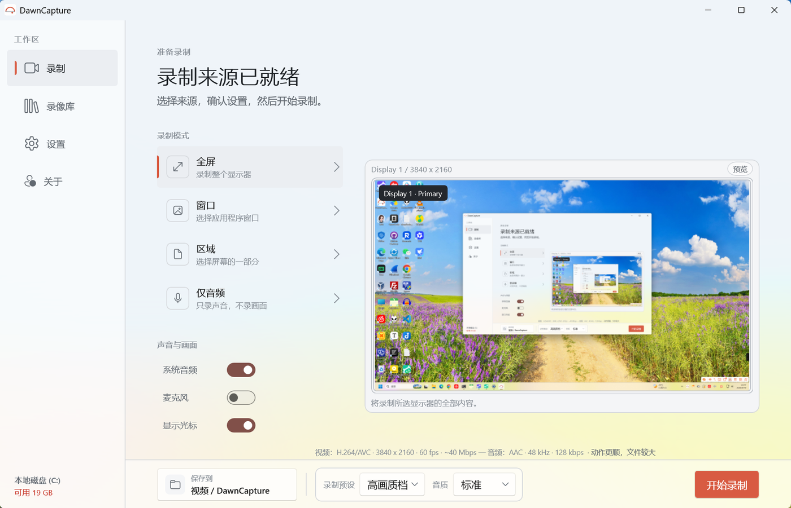

<h1 align="center">
  <br>
  DawnCapture
</h1>

<p align="center">
  轻量、简洁的 Windows 屏幕录制工具<br>
  窗口 · 全屏 · 区域 · 仅音频，录像始终保存在本机
</p>

<p align="center">
  <a href="LICENSE"></a>
  
  
  
</p>

<p align="center">
  <a href="README.md">English</a> · <b>简体中文</b>
</p>

<p align="center">
  <a href=".github/assets/main-window.zh-CN.png"></a>
</p>

## 功能

- **四种录制模式** —— 全屏（可指定显示器）、窗口、区域、仅音频（M4A）
- **双音源混音** —— 系统音频与麦克风可分别开关
- **硬件加速编码** —— H.264 默认，可选 HEVC，设备不支持时自动回退
- **倒计时与光标** —— 1–60 秒可配置倒计时（Esc 取消），可选是否录制光标
- **悬浮控制条** —— 置顶显示录制状态与计时，随时暂停、恢复、停止，可拖动
- **录像库** —— 缩略图、时长、大小与媒体信息，支持重命名、删除到回收站、定位文件
- **全局热键与托盘** —— 热键可自定义，录制时自动注销避免冲突；关闭窗口可最小化到托盘
- **双语界面** —— 简体中文 / English，跟随系统或手动切换
- **录像保存在本机** —— 文件写入你选择的文件夹，不会上传

## 下载安装

从 [Releases](https://github.com/lmshao/DawnCapture/releases) 获取：

| 渠道 | 说明 |
|---|---|
| **安装包**（推荐） | `DawnCapture-<版本>-x64-setup.exe`，双击安装；per-user，无需管理员，无需预装运行时 |
| **便携版** | `DawnCapture-<版本>-x64-portable.zip`，解压即用 |

> 安装包未做代码签名，首次运行可能触发 SmartScreen 提示（「更多信息」→「仍要运行」）；Windows 11 若开启 Smart App Control 会直接拦截且无法绕过。Microsoft Store 渠道计划中，由微软签名。

## 系统要求

Windows 10 2004（10.0.19041）或更高版本，x64 / ARM64。

## 从源码构建

需要 [.NET 10 SDK](https://dotnet.microsoft.com/download)。`run.ps1` 清理后构建并启动，`distribute.ps1` 打包各分发渠道（无参数显示帮助）。

```powershell
./run.ps1
dotnet build DawnCapture.csproj -c Debug -p:Platform=x64
./distribute.ps1
```

版本号只在 `Directory.Build.props` 定义一处，程序集、应用清单、安装器与产物文件名均由它派生。

## 数据位置

| 内容 | 位置 |
|---|---|
| 录像文件 | `%USERPROFILE%\Videos\DawnCapture`（可在设置中修改） |
| 设置与录像目录 | `%LocalAppData%\DawnCapture` |
| 日志（保留 14 天） | `%LocalAppData%\DawnCapture\logs` |

## 许可

[MIT](LICENSE) © 2026 SHAO Liming

第三方组件许可见 [THIRD-PARTY-NOTICES.md](THIRD-PARTY-NOTICES.md)，隐私政策见 [PRIVACY-POLICY.md](PRIVACY-POLICY.md)。
